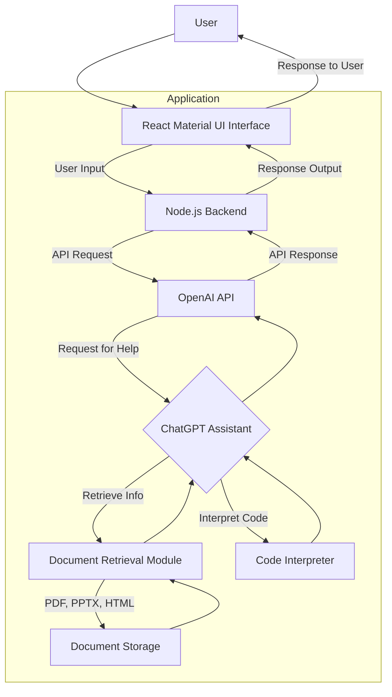

# :simple-openai: OpenAI Assistants

["Assistants"](https://platform.openai.com/docs/assistants/how-it-works){target=_blank} are highly similar to [GPTs](openai_gpts.md) but do not come with a ready-made chatbot, they rely on the OpenAI [API](openai_api.md) and charge the owner of the Assistant for each resposne. The Assistant allows you to select your own model, instructions, description, and knowledge retrieval. 

Assistants can be run on public facing chatbots. When users interact with the Assistant an API call is sent to OpenAI, a response generated, and returned to the chatbot. The owner of the Assistant will be charged for the number of input and output tokens that the user sends and the API responds with.

[OpenAI Developer Docs](https://platform.openai.com/docs/overview){target=_blank}

## Instructions

The prompt which your Assistant will use can be customized to use Code Interpreter, Retrieval, and Function calling. 

In this diagram, the ChatGPT Assistant accesses the 'Document Retrieval Module' which in turn retrieves required documents from 'Document Storage' e.g., `.PDF`, `.PPTX`, `.HTML` files. The ChatGPT Assistant can also utilize the Code Interpreter for interpreting code snippets or pieces of logic. Once interpreted, the results are fed back to the ChatGPT assistant.

## Models

as of 12/23/2023:

| model | tokens limit | Retrieval | additional notes |
|-------|--------------|-----------|------------------|
| `gpt-3.5-turbo` | 4,096 
| `gpt-3.5-turbo-1106` | 16,385
| `gpt-3.5-turbo-16k` | 16,385
| `gpt-4` |
| `gpt-4-1106-preview` |

## Description

## Knowledge Retrieval 

Assistants can use up to 20 files <512 MB each or 100 GB total. 

Each file should have <2,000,000 tokens (~150,000 words or ~300 printed text pages). 

# Creating an assistant programmatically

You can write your own Assistant in either `node.js`,`python`, or using `curl`