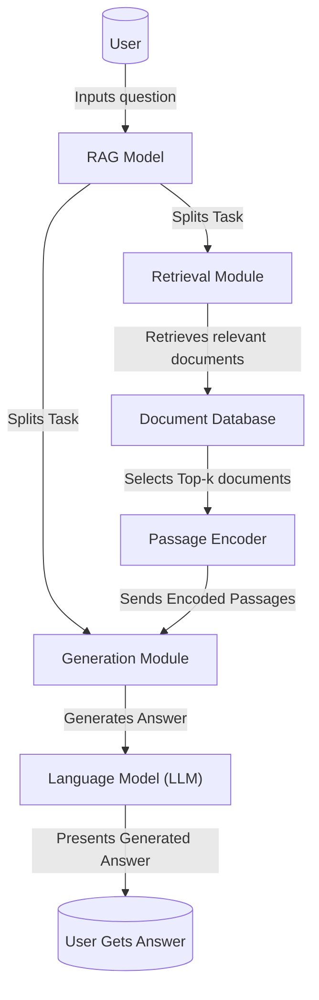

# Retrieval Augmented Generation (RAG)

In this graph representation:

- The **User** starts the process by inputting a question to the RAG model.
- The **RAG Model** breaks down the task into two modules: the Retrieval Module and the Generation Module.
- The **Retrieval Module** retrieves relevant documents from the **Document Database**.
- These documents are processed by the **Passage Encoder** which selects the top-k relevant documents and encodes them.
- The encoded passages are then fed to the **Generation Module**.
- The **Generation Module**, with help from the **Language Model (LLM)**, takes the user's question and the encoded passages to generate an answer.
- Finally, the answer generated by the language model is presented to the user as **User Gets Answer**.